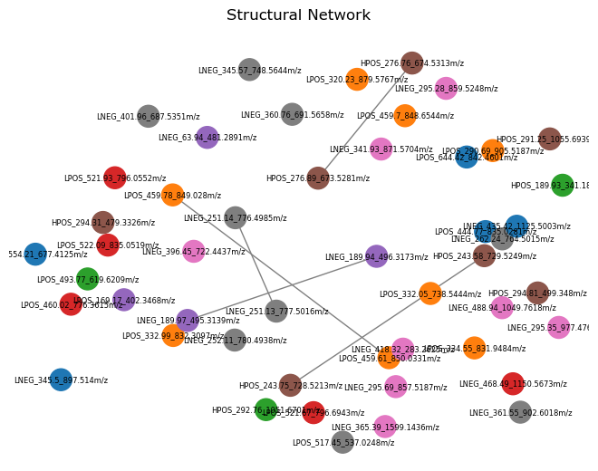

[](https://opensource.org/licenses/BSD-3-Clause)

# Tutorials and Supporting Materials
You can find all MAMSI tutorials by visiting our [MAMSI Tutorials](https://github.com/kopeckylukas/py-mamsi-tutorials) repository. 

The `MamsiPls` class inherits from the `mbpls` package [[1](./index.md/#references)]. For more information on MB-PLS, please visit [mbpls Documentation](https://mbpls.readthedocs.io/en/latest/index.html).

# Quickstart Tutorial
### Load Packages

```python 
from mamsi.mamsi_pls import MamsiPls
from mamsi.mamsi_struct_search import MamsiStructSearch
import pandas as pd
import numpy as np
```

### Load Sample Data
<br> Data used within this quickstart guide originate from the the AddNeuroMed [[2](index.md/#references)] cohort - dataset of Alzheimer's disease patients. 
You can download the sample data from this [link](https://github.com/kopeckylukas/py-mamsi-tutorials/tree/main/sample_data).

```python
metadata = pd.read_csv('../sample_data/alz_metadata.csv')
# The PLS algorithm requires the response variable to be numeric. 
# We will encode the outcome "Gender" (Biological Sex) as 1 for female and 0 for male subjects. 
y = metadata["Gender"].apply(lambda x: 1 if x == 'Female' else 0)

# Import LC-MS data
# Add prefix to the columns names. This will be crucial for interpreting the results later on.
hpos = pd.read_csv('./sample_data/alz_hpos.csv').add_prefix('HPOS_')
lpos = pd.read_csv('./sample_data/alz_lpos.csv').add_prefix('LPOS_')
lneg = pd.read_csv('./sample_data/alz_lneg.csv').add_prefix('LNEG_')
```

### Split data
Split the dataset to training and testing subsets. The training subset will be used to fit the model, cross-validation and estimation of the number of latent variables. Then the testing subset will be used as an independent dataset to assess the performance of the model. This will ensure that the model is not over-fitted to the data and that in can predict the outcome of the samples.

```python
# Split data in the ratio 90:10 for training and testing respectively.
hpos_train, hpos_test, y_train, y_test = train_test_split(hpos, y, test_size=0.1, random_state=42)
# Use a 'random_state' value (seed) for reproducibility of results

# Split the other two block based on the indices of the hpos block.
lpos_train = lpos.iloc[hpos_train.index,:]
lneg_train = lneg.iloc[hpos_train.index,:]

lpos_test = lpos.iloc[hpos_test.index,:]
lneg_test = lneg.iloc[hpos_test.index,:]
```

## Fit Basic Model
### Fit MB-PLS Model and Estimate LVs
Start with fitting a simple model utilising one latent variable. Then run the `MamsiPls.estimate_lv()` method to estimate the number of latent variables in the model. `MamsiPls.estimate_lv()` uses k-fold cross-validation (CV). The k-fold CV is repeated k-times corresponding to number of LVs in the most complex model. The lowest possible number of LVs where the model stabilised (model performance did not rise with adding more LVs) was selected as the final model.
```python 
mamsipls = MamsiPls(n_components=1)
mamsipls.fit([hpos_train, lpos_train, lneg_train], y_train)

# Estimate the number of latent variables in you model
mamsipls.estimate_lv([hpos_train, lpos_train, lneg_train], y_train, metric='auc')
```

<br>The LV estimation result shows that the model has 6 latent variables/components. Adding more LVs to the model could lead into overfitting 

### Evaluate Final Model
We can now evaluate the final model that utilises 6 LVs. Use `MamsiPls.evaluate_class_model()` to evaluate the final model on an independent `'testing'` dataset. 

```python
predicted = mamsipls.evaluate_class_model([hpos_test, lpos_test, lneg_test], y_test.array)
```


| Metric              | Score |
| ------------        | ----- |
| Accuracy            | 0.966 |
| Recall              | 1.0   |
| Specificity         | 0.943 |
| F<sub>1</sub> Score | 0.971 |
| AUC                 | 0.933 |

If the performance of the final model meet our requirements, we can now estimate the the importance of each feature and it's relationship to the outcome.


## Estimate Feature Importance
If the performance of the final model meet our requirements, we can now estimate the the importance of each feature and it's relationship to the outcome.

### Multiblock Variable Importance in Projection
We can visualise the Multiblock Variable Importance in Projection (MB-VIP):
```python
mb_vip = mamsipls.mb_vip(plot=True)
```


Despite that conventionally features with VIP scores greater than 1 are considered statistically significant, this might not be the most effective cut-off for features importance. Especially in a multiblock model, the block size of each data block play a role to overall importance of each features in the given block. 
We can employ permutation testing to estimate empirical p-values for each variable instead. 

### Permutation Testing
The empirical p-values for *i<sup>th</sup>* feature are calculated be **dividing** the number of MB-VIP scores  of Null model for *i<sup>th</sup>* feature **lower** than the *observed* MB-VIP score for *i<sup>th</sup>* feature, **over the total number of permutations**.

```python
p_vals, null_vip = mamsipls.mb_vip_permtest([hpos, lpos, lneg], y, n_permutations=10000, return_scores=True)
```


*Note that the pre-calculated null_vip file contains MB-VIP scores for first 400 null models (permutations) so the p-value displayed on the plot below does not correspond with the plot itself.*

## Interpret Statistically Significant Features
```python
x = pd.concat([hpos, lpos, lneg], axis=1)

mask = np.where(p_vals < 0.01)
selected = x.iloc[:, mask[0]]
```
Use `MamsiStrustSearch` to search for structural links within the statistically significant features. <br>
Firstly, all features are split into retention time (*RT*) windows of 5 seconds intervals, then each RT window is searched for isotopologue signature’s by searching mass differences of 1.00335 *Da* between mass-to-charge ratios (*m/z*) of the features; if two or more features resemble mass isotopologue signature then they are grouped together. This is followed by a search for common adduct signatures. This is achieved by calculating hypothetical neutral masses based on common adducts in electrospray ionisation. If hypothetical neutral masses match for two or more features within a pre-defined tolerance (15 *ppm*) then these features are grouped together. Overlapping adduct clusters and isotopologues clusters are then merged to form structural clusters. Further, we search cross-assay clusters using [M+H]<sup>+</sup>/[M-H]<sup>-</sup> as link references. Additionally, our structural search tool, that utilises region of interest [(ROI) files](https://github.com/phenomecentre/npc-open-lcms) from [peakPantheR](https://rdrr.io/bioc/peakPantheR/) [[4](./index.md/#references)], allows for automated annotation of  some features based on the *RT* for a given chromatography and m/z.
   
### MAMSI Structural Search Tool
```python
struct = MamsiStructSearch(rt_win=5, ppm=10)
struct.load_lcms(selected)
struct.get_structural_clusters(annotate=True)
```
Further, use can find correlation clusters
```python
struct.get_correlation_clusters(flat_method='silhouette', max_clusters=11)
```


Finally, we visualise the structural relationships using a network plot. The different node colours represent different flattened hierarchical correlation clusters, while the edges between nodes identify their structural links. You can also save the network as an NX object and review in Cytoscape to get better insight on what these the structural relationship between individual features are (e.g. adduct links, isotopologues, cross-assay links).
```python
network = struct.get_structural_network(include_all=True, interactive=False, labels=True, return_nx_object=True)
```

